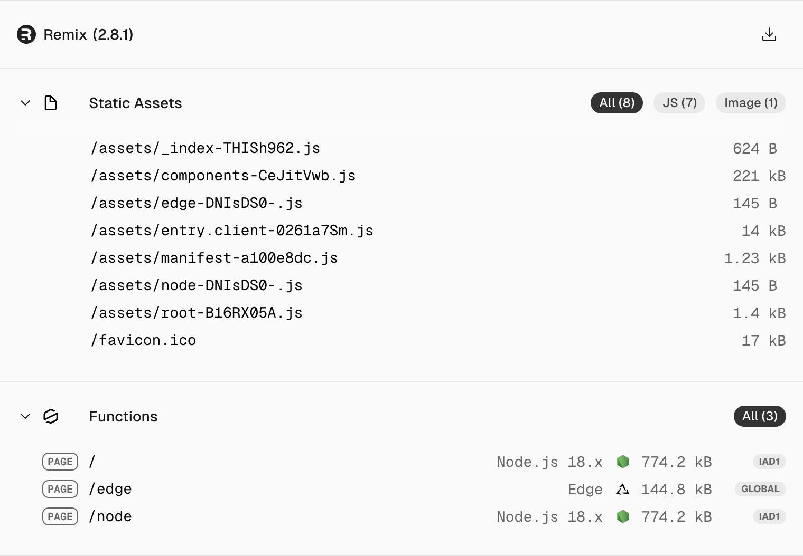

# Remix + Vercel Edge + Clerk issue repro

This is a nearly-empty remix project, created with `pnpx create-remix@latest`.

Two routes have been added at /node and /edge, demonstrating both runtimes.

This deploys and runs on Vercel just fine (from the `main` branch):
https://remix-vercel-edge-clerk.vercel.app/

Vercel reports two Node.js functions, and two Edge functions:



## Adding Clerk

Adding Clerk (following the [quick start doc](https://clerk.com/docs/quickstarts/remix)) breaks the Vercel deployment, with an error like this:

```
[21:39:52.506] Error: The Edge Function "404" is referencing unsupported modules:
[21:39:52.507] 	- @clerk: #crypto, #fetch
[21:39:54.707]
```

The Clerk changes are on the `clerk` branch.

## Repro Steps

 - Fork this repo with all branches (uncheck "Copy the main branch only")
 - Sign in to Vercel and add a project connected to the git repo. (it should deploy the `main` branch successfully)
 - Checkout the `clerk` branch and push an empty commit to cause a vercel deploy (e.g. `git commit --allow-empty -m "empty commit"`)
   - this deploy should fail with the above symptom.
 
